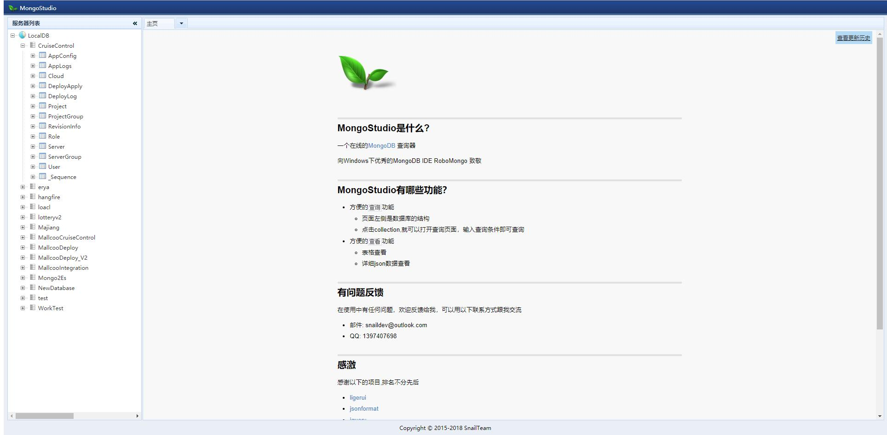
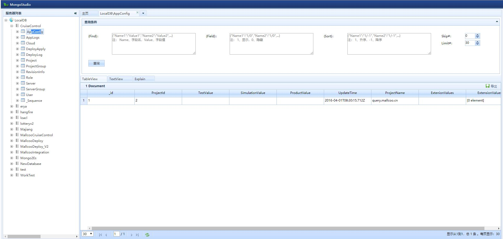
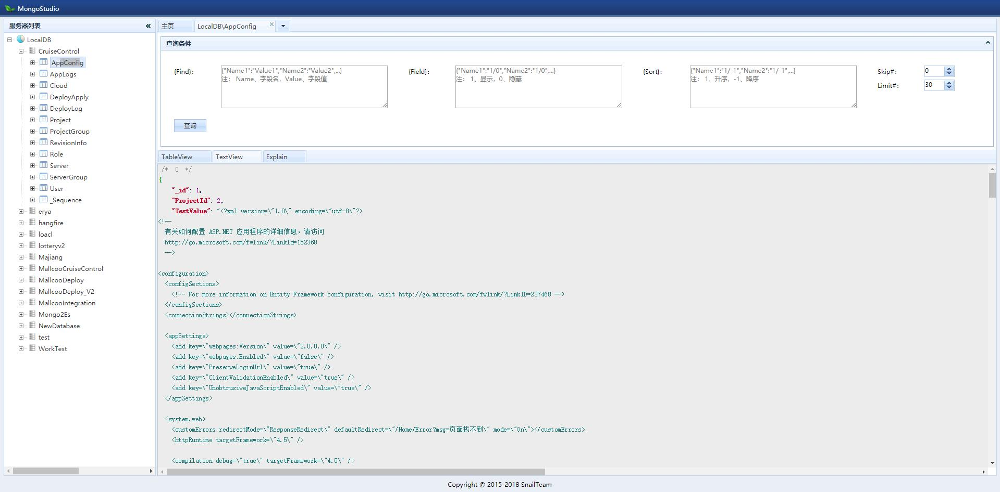

# MongoStudio
a tool for mongodb web search

### How to start
```bash
git clone https://github.com/SnailDev/SnailDev.MongoStudio.git
cd src/MongoStudio
npm install
npm start
```

### Preview
- index


- tableview


- textview


- explain


### Reference
- [ligerui](http://www.ligerui.com/)
- [jsonformat](http://tool.oschina.net/codeformat/json)
- [jquery](http://jquery.com/)

## License

The MIT License (MIT). Please see [LICENSE](LICENSE) for more information.
